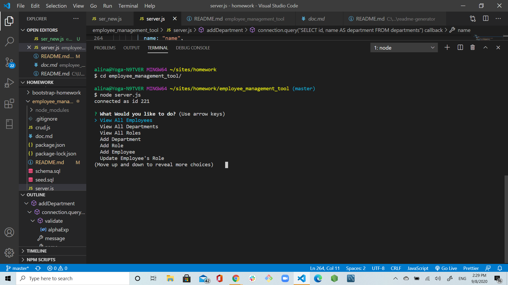
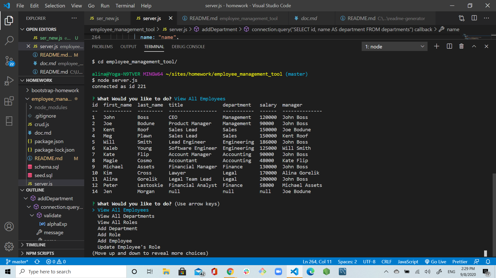
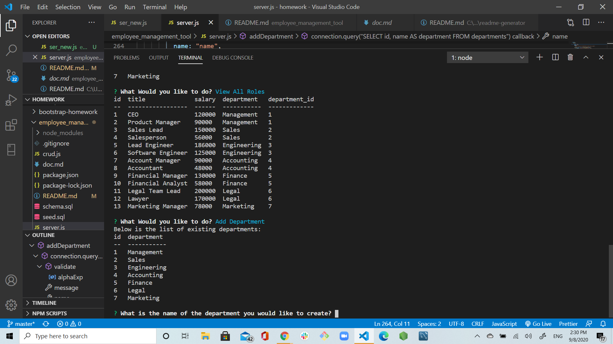
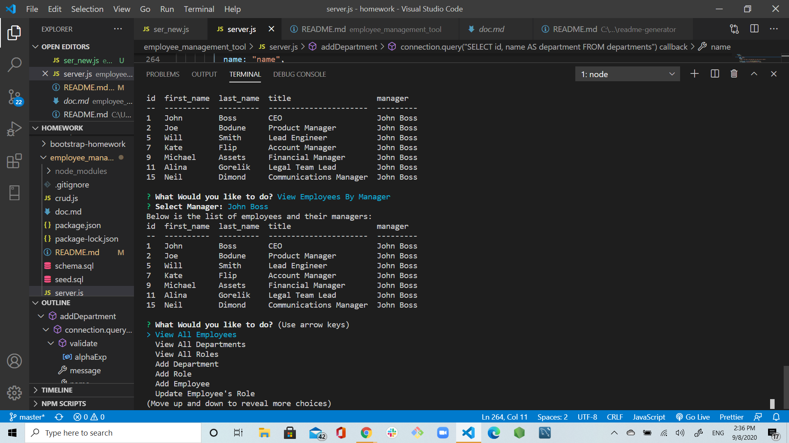
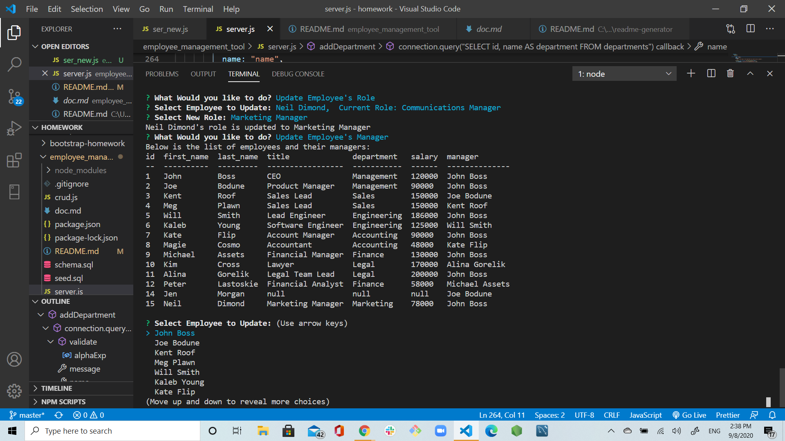
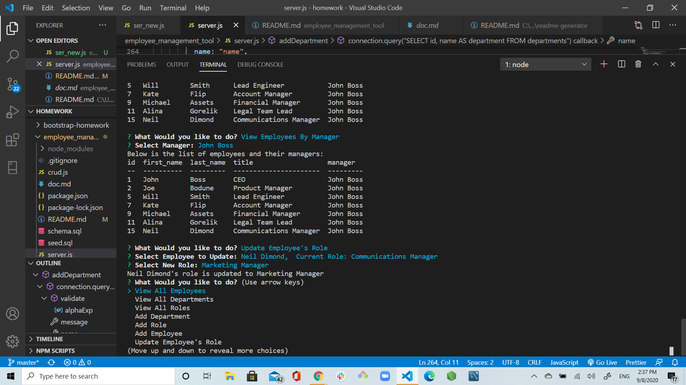
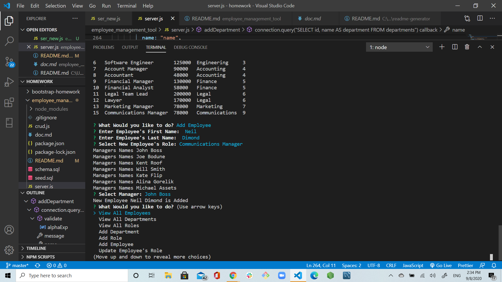
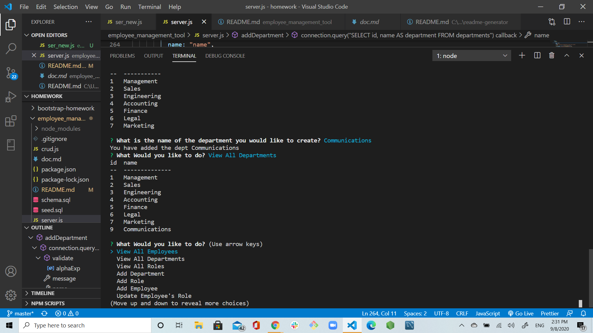
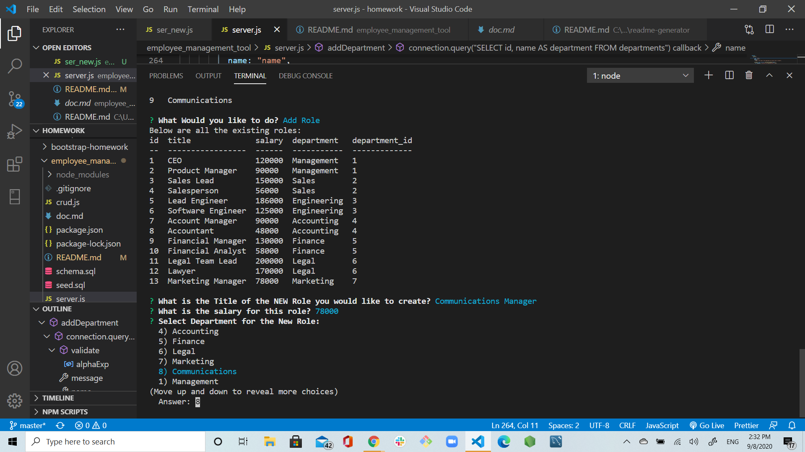
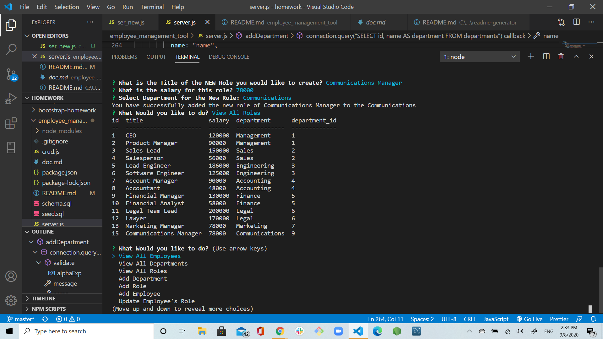

# employee_management_tool

## Application Video Link:

[Video of the Employee Management Tool](https://drive.google.com/file/d/1hzCtcGEVT6YszbkCVwTFWxWbMi0k_Lhw/view)

# Username:

agorelik2

# Title:

Employee Management Tool

# Table of Content

- [Description](#description)
- [User Story](#user-story)
- [Database Configuration](#database-configuration)
- [Functionality](#functionality)
- [Screen Shots](#screen-shots)
- [Installation](#installation)
- [Dependencies](#dependencies)
- [Tests](#tests)
- [Built With](#built-with)
- [Repo](#repo)
- [Demo](#demo)
- [Developer](#developer)
- [CopyRight](#copyright)

# Description:

The application is an interface that makes it easy for non-developers to view and interact with information stored in databases. Often these interfaces are known as Content Management Systems.

# User Story

```
As a business owner
I want to be able to view and manage the departments, roles, and employees in my company
So that I can organize and plan my business
```

# Database Configuration

Using mySQL, designed the following database schema containing three tables:


- **department**:

  - **id** - INT PRIMARY KEY
  - **name** - VARCHAR(30) to hold department name

- **role**:

  - **id** - INT PRIMARY KEY
  - **title** - VARCHAR(30) to hold role title
  - **salary** - DECIMAL to hold role salary
  - **department_id** - INT to hold reference to department role belongs to

- **employee**:

  - **id** - INT PRIMARY KEY
  - **first_name** - VARCHAR(30) to hold employee first name
  - **last_name** - VARCHAR(30) to hold employee last name
  - **role_id** - INT to hold reference to role employee has
  - **manager_id** - INT to hold reference to another employee that manager of the current employee. This field may be null if the employee has no manager

# Functionality

The application utilizes node, inquirer, and MySQL. This is a command-line application that at a allows the user to:

- Add departments, roles, employees;

- View departments, roles, employees;

- Update employees roles;

- View employees by manager;

- Update employees manager;

- Delete departments, roles, employees;

# Screen Shots





















# Installation

To use this application:

- User will need to install Node.js on their computer.
- Use `npm init` to build package.json and node_modules.
- Use `npm install` to install all the dependencies, see [Dependencies](#dependencies) for the complete list
- Use MySQL or MSSQL database, create the DB using the _schema.sql_ file, you can reciew the database schema on the [Sql schema](#schema) file
- Using the _seed.sql_ file to popluate the DB
- Once you have all the above created, you can edit the _server.js_ file where the password is and add your password to access your local DataBase.
- Open a terminal, navigate to the folder where **_server.js_** is located and type: `node server.js`
- Navigate the menu using the arrow keys
- Press enter to select the element highlighted
- Follow the prompts for addin employess, roles and departments
- Select **QUIT** in the menu to end the application

## Dependencies

- Use the [MySQL](https://www.npmjs.com/package/mysql) NPM package to connect to your MySQL database and perform queries.

- Use [InquirerJs](https://www.npmjs.com/package/inquirer/v/0.2.3) NPM package to interact with the user via the command-line.

- Use [console.table](https://www.npmjs.com/package/console.table) to print MySQL rows to the console.

## Built With

- [VScode](https://code.visualstudio.com/)
- [Gitbash](https://gitforwindows.org/)

## Repo:

https://github.com/agorelik2/employee_management_tool

## Demo:

https://drive.google.com/file/d/1hzCtcGEVT6YszbkCVwTFWxWbMi0k_Lhw/view

## Developer

- **Alina Gorelik**

## CopyRight

Copyright 2020 &copy; Alina Gorelik
